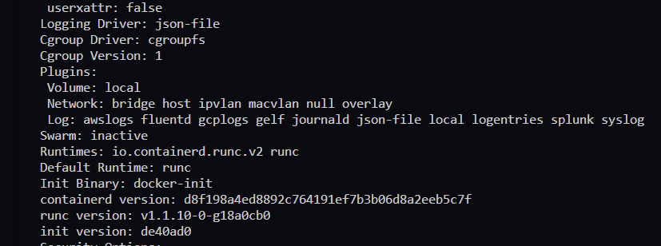

# Taminatherme Crawler

## Setup

### Create the docker container

1. Download the repository with `git clone https://github.com/grab7777/taminatherme-crawler.git`
1. Copy the example.env, rename it to .env and add all required information
1. Make a new file called db_password.txt and insert the database password
1. You can change the cron timings in the file `cron`
1. create the container with `docker image build -t taminatherme-crawler:latest .`
1. If you get `cron` errors: Make sure the cron file is written with `LF` at the end, not `CRLF`!

---

1. make sure, docker swarm is enabled (`docker info`)

   

1. if not: `docker swarm init`
1. write the secret for the DB into a docker secret: `echo -n "secret here" | docker secret create secure-key - `
1. you can also put the secret into a file and run `docker secret create secure-key - < my_key.txt`

TODO: did not use the key file...
